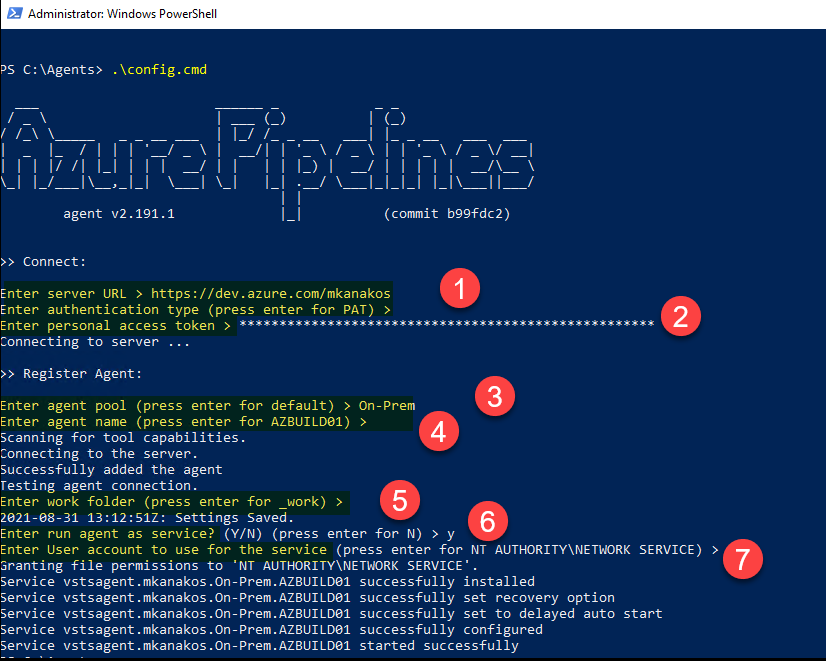

# SoCal PSUG: Running On-Prem Automation with Azure DevOps Services

### Agenda

- AzDevOps: What is it and what does it do?
- Highlight why you want to consider AzDevOps (Hint: cost, features & flexibility)
- How to run on-prem workloads from in the Azure cloud.. why?
- Show off the interface / How to get started
- Explain the buttons and knobs
- Create and run some automation

### Who Am I?

- Microsoft MVP
- Invisalign: Sr Infrastructure Tools Engineer
  - Azure AD
  - Active Directory
  - SSO
  - PowerShell tools & scripts
  - Azure DevOps
- Leader RTPSUG
- Twitter: @MikeKanakos
- Web: www.networkadm.in
- Email mkanakos@gmail.com

### Why AZDevOps?

- What choices do you have today?
  - Windows: task scheduler (scheduled tasks and scheduled jobs)
  - Linux: cron jobs
  - 3rd party tools (Jenkins, Ansible, PowerShell Universal, Octopus Deploy, etc.)
- AZDevOps can handle all sizes of automation
- Very affordable automation solution for ANY size business (Free! Yes, free!)
- AZ DevOps not thought of as an on-prem solution, but it  manage cloud or on-premises resources
- SAAS: MS maintains the environment (automation in the cloud)
- Email and AD Integration built in if you're already in the cloud
- Engine can handle multiple languages
- Lots of choices, but can but simplified to the basics
- GUI or command line based

### AZDevOps Diagram

### AZDevops Svcs

Azure DevOps website: https://dev.azure.com/your-AZDevops-Acct

## Azure DevOps Cost

- cost calculator - https://azure.microsoft.com/en-us/pricing/calculator/
- surprisingly cheap - you can absolutely run AzDevOps for $0

## My Lab Setup

- on-prem domain: Active Directory
- - automation engine: AZ DevOps
  - git repo: my code
  - pipelines: engine
  - Project: where all my settings live
- ~~cloud: AzureAD~~

## First Steps with Azure DevOps

- Azure DevOps website: https://dev.azure.com/
- setup an acct
- make a project
- turn off what you don't need
- setup a repo
- commit code
- setup a job
- run job

## AZ DevOps Interface

### Projects

- Overview (shut off AZ DevOps services)
- Permissions (self explanatory)
- Notifications
- Settings (days to keep data)
- Agent Pools

### AZ Build Agent Process

- download agent
- create PAT
- unzip & install agent
- follow cmd line prompts

### Repo setup

- standard git setup

### Pipelines

- default view is history
  - job name - last run - run time
- jobs
  -
- library
  - variables / variable groups
  - link to jobs
