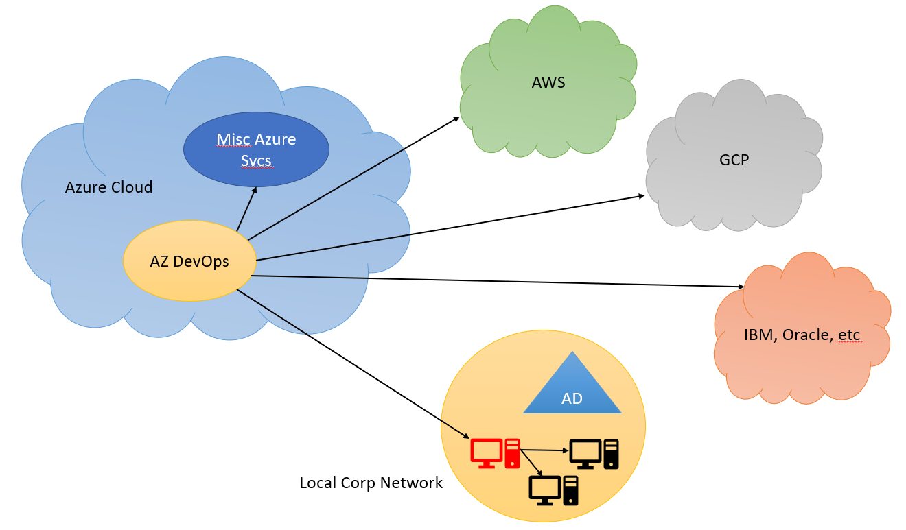
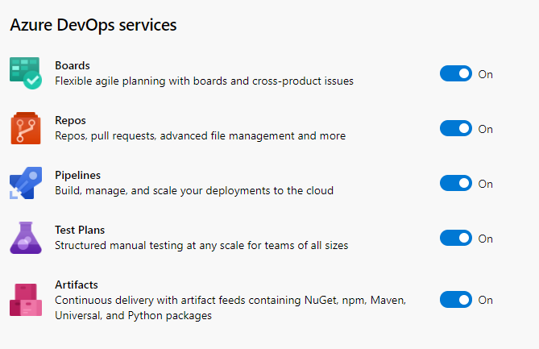

# SoCal PSUG: Running On-Prem Automation with Azure DevOps Services

### Agenda

- Walk thru services available from Azure for "scheduled automation"
- Highlight why you want to consider ADevOps (Hint: cost, features & flexibility)
- How to run on-prem workloads from in the Azure cloud.. why?
- Show off the interface / How to get started
- Explain the buttons and knobs
- Create some automation

### Who Am I?

- Microsoft MVP
- Invisalign: Sr Infrastructure Tools Engineer
  - Azure AD
  - Active Directory
  - SSO
  - PowerShell tools & scripts
  - Azure DevOps
- Leader RTPSUG
- Twitter: @MikeKanakos
- Web: www.networkadm.in
- Email mkanakos@gmail.com

### Why AzDevOps?

- What choices do you have today?
  - Windows: task scheduler (scheduled tasks and scheduled jobs)
  - Linux: cron jobs
  - 3rd party tools (Jenkins, Ansible, PowerShell Universal, Octopus Deploy, etc.)
- Can handle all sizes of automation
- AZ DevOps not thought of as an on-prem solution
- Lots of choices, but can but simplified to the basics
- Very affordable automation solution for ANY size business
- Email and AD Integration built in if you're already in the cloud
- SAAS: MS maintains the environment
- Engine can handle multiple languages
- GUI or command line based

### What are AZDevOps Svcs?

- Collection of enterprise grade automation services
- Can manage cloud or on-premises resources
- Can be a completely free service!!!
- Azure DevOps website: https://dev.azure.com/your-AZDevops-Acct

### AZDevOps Diagram

### AZDevops Svcs Breakdown:

## Azure DevOps Cost

- cost calculator - https://azure.microsoft.com/en-us/pricing/calculator/
- surprisingly cheap - you can absolutely run AzDevOps for $0

## My Lab Setup

- on-prem domain: Active Directory
- cloud: AzureAD
- automation engine: AZ DevOps
  - git repo: my code
  - pipelines: engine
  - Project: where all my settings live

## First Steps with Azure DevOps

- Azure DevOps website: https://dev.azure.com/
- setup an acct
- make a project
- turn off what you don't need
- setup a repo
- commit code
- setup a job

## AZ DevOps Interface

### Projects

- Overview (shut off AZ DevOps services)
- Permissions (self explanatory)
- Notifications
- Settings (days to keep data)
- Agent Pools

### AZ Build Agent Process

- download agent
- create PAT
- unzip & install agent
- follow cmd line prompts

### Repo setup

- standard git setup

### Pipelines

- default view is history
  - job name - last run - run time
- jobs
  -
- library
  - variables / variable groups
  - link to jobs

